# Placet Intelligent Pipeline Development Process

> **Document role**: this file is the pipeline **process fact source** (formerly root `README.md`; renamed to `PLACET.md` in 2026-08 so it is not confused with the GitHub product intro).
> Agents / process changes read this file; human users should start with [README.md](README.md) and [QUICKSTART.md](QUICKSTART.md).
>
> **Nav**: [Product intro](README.md) | [Quick start](QUICKSTART.md) | [Knowledge-base rules](docs/KNOWLEDGE_BASE_RULES.md) | [Install guide](QUICKSTART.md#install)

This project is an AI-assisted development pipeline for Claude Code. It automates the full path from a short natural-language requirement → requirements analysis → PRD → software design → code implementation → test cases → test report. Each stage waits for human confirmation before the next stage, so quality stays controllable.

---

## Design idea

The current directory `this repository root (claude-code-autopilot)` is the **shared framework directory**. It only holds:
- All Agent definitions (`.claude/agents/`)
- All hook scripts (`.claude/hooks/`)
- Framework core (`.claude-collective/`)
- Global behavioral rules (`CLAUDE.md`)
- Product intro (`README.md`)
- Process rulebook (`PLACET.md`, this file)

**When you analyze a project / develop a feature**:
- You provide the target project directory path (e.g. `D:\projects\my-existing-project`)
- All generated artifacts (project knowledge base, requirements analysis, PRD, design, test cases, test report) are **written under the target project directory**
- The shared framework directory is not polluted, so files do not collide
- Each project keeps its own docs; the split stays clear

---

## How to pick among the three PRD Agents (avoid misuse)

Placet and Collective each have PRD-related Agents. **Entry and output differ**:

| Your scenario | What to say | Agent / method | Output location |
|---------------|-------------|----------------|-----------------|
| **Placet pipeline Task 4** (most common) | In the target project, say `generate PRD` | `prd-generation-agent` | `docs/{requirement-id}/02-prd.md` |
| Collective: split a PRD into TaskMaster tasks | `build app from PRD` (framework directory `/van`) | `prd-research-agent` | TaskMaster task queue |
| Enterprise PRD (market, compliance, full architecture) | Collective generic create (not Placet Task 4) | `prd-agent` | Per session convention; **not** the standard `02-prd.md` |

```text
Doing feature development in the target project?
  └─ yes → generate PRD → prd-generation-agent → 02-prd.md

Using Collective + TaskMaster in the framework directory?
  └─ generate tasks from a PRD → prd-research-agent

Need an enterprise market/compliance PRD (not the Placet standard flow)?
  └─ prd-agent (or prd-mvp for a simple prototype)
```

---

## Directory structure

Key files in the framework directory:

| Directory / file | Role |
|------------------|------|
| `.claude/agents/` | Agent definitions (30+ specialist Agents) |
| `.claude/hooks/` | Hook scripts (SessionStart injects rules, etc.) |
| `.claude/settings.json` | Project-level settings |
| `.claude-collective/` | Framework core (`cicd-rules.md` is the rule digest) |
| `skills/` | Placet Skill definitions (`placet-*`: init, knowledge base, knowledge-base update, fact gate, status, context compress, skill eval, env setup, UI/UX, now) |
| `CLAUDE.md` | Project behavioral rules |
| `README.md` | Product intro (humans / GitHub) |
| `PLACET.md` | This file (AI process rulebook / fact source) |
| `QUICKSTART.md` | Quick reference |
| `install.sh` | Install script |

> Fuller Claude Code usage: [docs/PLACET_CLAUDE_CODE_GUIDE.md](docs/PLACET_CLAUDE_CODE_GUIDE.md)

### Target-project output directories (isolated per requirement)

```
your-target-project/
├── docs/
│   ├── knowledge-base/                  → project knowledge base (shared, incremental updates)
│   ├── user-login/                      → requirement A (one directory per requirement)
│   │   ├── 01-requirements-analysis.md
│   │   ├── 02-prd.md
│   │   ├── 03-software-design.md
│   │   ├── 04-test-cases.md
│   │   ├── 05-test-report.md
│   │   └── CHANGELOG.md
│   └── ...
├── tests/{requirement-id}/               → test code (isolated per requirement)
└── (project source...)
```

### Test-code directory rules

- **Location**: `[target-project]/tests/{requirement-id}/`, sibling of `docs/`
- **Do not put tests in source subdirectories**: keep tests from scattering into deep business folders; keep the project-root layout clear
- **Isolate per requirement**: each requirement has its own test directory; they do not interfere
- **Directory confirmation**: before generating test code, the AI MUST print the directory path for user confirmation; custom paths are allowed

**Directory confirmation flow (when Task 6 / Task 8 generate test code):**
```
AI: 📂 Test-code directory confirmation
    Default path: D:\projects\my-app\tests\user-login\
    Files included:
      - run_tests.js          (test runner)
      - unit/user-login.test.* (unit tests generated for the target project's stack)

    Adjust the path? (press Enter to confirm, or type a custom path)

User: press Enter → use the default path
User: change to D:\my-tests\user-login\ → use the custom path
```

### Requirement-id rules

Each requirement has a **short English id** (kebab-case) used to create a dedicated docs directory. The user only needs a requirement description; the AI auto-suggests an English id and **MUST wait for user confirmation before continuing**:

```
User: requirements analysis: user login and registration module, target project: D:\projects\my-app

AI: Requirement [user login and registration module] suggested English id: user-login
    Adjust? (after confirmation, docs/user-login/ will be the docs directory)

User: looks good → use user-login
User: change to login-register → use login-register
```

> Key points:
> - Framework directory and project artifacts are **fully separated** and do not interfere
> - Different requirements are **fully isolated** and do not overwrite each other
> - knowledge-base stays shared (one per project) and is updated incrementally on changes
> - Test code lives in `tests/{requirement-id}/` (sibling of docs), not in source subdirectories
> - Before generating test code, **MUST confirm the directory path** so files are not misplaced

---

## Core concept: how does the pipeline run?

Placet **recommended path** (target project directory):

1. `/placet-init` to activate
2. Natural language or `/placet-*` Skills drive each task
3. Agents via `$FRAMEWORK/.claude/agents/*.md` + Task delegation (see [PLACET_CLAUDE_CODE_GUIDE.md](docs/PLACET_CLAUDE_CODE_GUIDE.md))

**Optional**: in the framework directory, use `/van` for Collective sub-agent routing (research/experiments; not the Placet main path).

### Placet × Superpowers integration principles

Placet owns the project-level pipeline: entry triggers, requirement-id confirmation, stage switches, S/M/L leveling, target-project artifact paths, and human confirmation. Superpowers is only in-stage methodology: not a new main entry, and it does not decide stage jumps.

| Placet stage | Superpowers enhancement | Artifact / evidence |
|--------------|-------------------------|---------------------|
| Empty-project skeleton planning | brainstorming + writing-plans | Tech stack, directory structure, shared-type plan |
| Task 3 requirements analysis | brainstorming | Implicit assumptions, non-functional requirements, risk-question list |
| Task 4 PRD | Optional lightweight review | Acceptance-criteria consistency check |
| Task 4.5 interface contract first | brainstorming | Endpoints, DTOs, error codes, key sequences |
| Task 5 software design | brainstorming + writing-plans | Architecture trade-offs, batch plan, rollback strategy |
| Task 6 code implementation | test-driven-development | RED/GREEN/REFACTOR and test results |
| Debugging / end of batch | systematic-debugging + code-review + verification | Repro record, review conclusion, verification results |

> Any Superpowers enhancement MUST be called inside a Placet stage, and output evidence MUST be recorded. If a gate fails, stay on the current stage; do not enter the next stage.

---

## Stage-by-stage tasks

### Task 1: Environment init ✅ Done

- **Work**: install Placet Skills, write the framework path, configure Agents, Hooks, and global behavioral rules
- **Artifacts**: `.claude/agents/`, `skills/`, `CLAUDE.md`, `~/.claude/placet-framework-path`
- **Status**: done

---

### Task 2: Generate a historical-project knowledge base ⏳ Waiting to start

- **Purpose**: when you already have a historical project to bring into AI-assisted development, first generate a project knowledge base so the AI understands existing structure, coding style, and reusable assets. **Every later stage automatically uses this knowledge base as reference**, so new code matches existing style and structure. **Key: later Agents only need this knowledge base to understand the project; they do not need to rescan the entire source**, which saves context.
- **Your input example**:
  ```
  generate knowledge base, target project: D:\projects\my-existing-project
  ```
- **Tool**: call your custom Skill → `/placet-knowledge-base`
- **Actual call example (framework runs this; you do not type it)**:

  ```
  /placet-knowledge-base --target "D:\projects\my-existing-project" --output "D:\projects\my-existing-project\docs\knowledge-base\PROJECT_KNOWLEDGE_BASE.md"
  ```
- **Output**: `[target-project]/docs/knowledge-base/PROJECT_KNOWLEDGE_BASE.md`

  - 👉 **Written to the target project, not the framework directory**
  - For more complex projects, a deep analysis also writes `[target-project]/docs/knowledge-base/PROJECT_KNOWLEDGE_DETAIL.md`
  - Contents: architecture overview, module dictionary, reusable tools/components index, refactor suggestions
- **Your work**: only tell me the target project path
- **My work**:

  - Auto-create `docs/knowledge-base/` under the target project if missing
  - **First step**: run `preflight-kb.sh` / `preflight-kb.ps1` for a lightweight self-check; show source-file count, project size, whether it is a large project, CodeGraph Status, and suggested action
  - If it is a large project, MUST ask whether to use CodeGraph; only after you confirm may `codegraph build` run. On success, use `.codegraph/` as input for module-dependency analysis. If not installed, failed, or you decline, warn about time risk and degrade to “index-first + per-module deep scan”
  - Auto-call the Skill to generate docs
  - After generation, run `node "$FRAMEWORK/skills/placet-knowledge-base/scripts/validate-kb.js" "<target-project-path>" [--strict]` to validate BASE/DETAIL, Requirement Index, update history, and CodeGraph Status
  - After structure validation passes, run `node "$FRAMEWORK/skills/placet-knowledge-fact-gate/scripts/verify-kb-facts.js" "<target-project-path>"` to refresh the admit list
  - Remember the knowledge-base path. When later stages delegate Agents, MUST run the fact gate first (with `--query`) and treat only pass as current fact; BASE/DETAIL are search clues. The whole project source does not need to be loaded into context, but fail rows MUST drill into related source
  - After generation, **tell you explicitly**: which file was generated and its full path
- **Done when**: knowledge base generated → **you confirm** → next task (stage 3: requirements analysis)

---

### Task 3: Requirements analysis ⏳ Waiting to start

- **Purpose**: turn a few sentences of natural-language requirement into a structured requirements-analysis document, and proactively list every ambiguous point to clarify. **The AI also auto-assesses the change level**, which decides whether later stages use the standard flow (S/M) or the full L-level flow (HLD+LLD design + execution strategy + test cases + regression checklist).
- **Depends on**:

  - If Task 2 is done → **run the fact gate first** (`verify-kb-facts.js --query`); automatically include pass rows from `PROJECT_KNOWLEDGE_ADMITTED.md`; BASE/DETAIL are clues. fail MUST NOT be treated as fact
  - If Task 2 is skipped (greenfield) → depend only on the original requirement you provide
- **Input**: target project directory path + your original requirement (a few sentences is enough)
- **Your input examples**:

  ```
  requirements analysis: D:\projects\my-app, requirement: I need a user login and registration module, with SMS-code login, password login, and remember-password.
  ```
  ```
  requirements analysis: D:\projects\my-app, requirement: upgrade Spring Boot from 2.7 to 3.2
  ```
- **Tool**: delegate `requirements-analysis-agent` (see [PLACET_CLAUDE_CODE_GUIDE.md](docs/PLACET_CLAUDE_CODE_GUIDE.md))
- **Output**: `[target-project]/docs/{requirement-id}/01-requirements-analysis.md`
  - 👉 **Written under the target project's requirement directory, not the framework directory**
  - Contents: project background, goals, functional requirements list, non-functional requirements, **open questions** (AI lists ambiguities for you to confirm)
  - Superpowers enhancement: layer `brainstorming` only to challenge implicit assumptions, probe NFRs, and list unstated customer risks; do not expand business scope on your own
- **🔴 Change-level assessment (critical step)**:
  - After generating requirements analysis, the AI **auto-assesses the change level** and prints:
    ```
    📊 Change-level assessment

    Requirement type: new feature / framework upgrade / bulk refactor / ...
    Estimated files affected: about XX
    Estimated modules affected: XXX
    Change level: S / M / L

    Rationale: ...
    Later flow: standard flow (S/M, 6 stages) / full L-level flow (5 docs: design + strategy + test cases + regression checklist + report)

    Adjust? (press Enter to confirm, or type S/M/L)
    ```
  - **After you confirm the level, every later stage adapts automatically** (see “Change-level mechanism”)
  - You may also specify it in the input: `level: L`
- **Your work**: only provide the target path + requirement description (the AI suggests an English id and asks you to confirm)
- **My work**:
  - Remember the target project path
  - **Auto-suggest an English id and ask you to confirm** (e.g. Requirement [user login and registration module] suggested English id: user-login. Adjust?)
      - Immediately after id confirmation, create `00-original-requirements.md` + `CHANGELOG.md` (before any analysis), and create `docs/{requirement-id}/`
      - Run requirements analysis, auto-assess the change level, and print a level recommendation
  - **When delegating Agents, paste full absolute paths of all dependency files into the command** → the AI can find files even in a new session
  - If Task 2 (project knowledge base) is done, include the knowledge-base path when delegating `requirements-analysis-agent`:
    ```
    requirements analysis: based on the user's original requirement, run the knowledge-base fact gate first; treat only ADMITTED pass as current fact; BASE/DETAIL are clues. Generate a detailed requirements-analysis document E:\project\your-project\docs\user-login\01-requirements-analysis.md. The document MUST include: 1) project background 2) goals 3) functional requirements list 4) non-functional requirements 5) open questions
    ```
  - After generation, **tell you explicitly**: which file was generated, its full path, and the change level
- **Done when**: requirements-analysis document written + change level confirmed → **you confirm and clarify every question** → next task at the matching level

---

### Task 4: Generate PRD ⏳ Waiting to start

- **Purpose**: from the clarified requirements analysis, generate a complete PRD
- **Depends on**:
  - Task 2 (if done) → project knowledge base `PROJECT_KNOWLEDGE_BASE.md`; if `PROJECT_KNOWLEDGE_DETAIL` exists, include it too
  - Task 3 → requirements analysis `01-requirements-analysis.md`
  - When delegating Agents, **automatically include all dependencies**
- **Input**: requirements analysis is already confirmed and I already remember the target project path; you do not need to repeat it — just say `generate PRD`
- **Your input example**:
  ```
  generate PRD
  ```
- **Output**: `[target-project]/docs/{requirement-id}/02-prd.md`
  - 👉 **Written under the target project's requirement directory, not the framework directory**
  - Contents: user stories (who, what, why), functional specs, interaction flows, acceptance criteria
- **My work**:
  - Auto-join full paths; when delegating Agents, **automatically include all dependency file paths**
  - If Task 2 is done, auto-add to the call: `run verify-kb-facts.js --query first; treat only pass in ADMITTED/query-admit as current fact; BASE/DETAIL are clues; do not load the entire project source into context`
  - The full call command auto-joins **full absolute paths** of all dependencies so a new session can still find files
  - After generation, **tell you explicitly**: which file was generated and its full path
- **Done when**: PRD written → **you review and confirm** → next task (stage 5: software design)

---

### Task 4.5: Interface contract first (recommended for high-risk projects) ⏳ Waiting to start

- **Purpose**: freeze key interface boundaries between PRD and software design. Fits B2B, split frontend/backend, multi-table models, upstream/downstream integration, L-level greenfield, and similar cases.
- **When to trigger**:
  - L-level requirements enable it by default
  - Recommended when API / RPC / DTO / error codes / data models are involved
  - S-level and purely internal small edits MAY skip
- **Input**:
  - Task 4 → PRD `02-prd.md`
  - Task 3 → requirements analysis `01-requirements-analysis.md`
  - Knowledge base (if present)
- **Output**: `[target-project]/docs/{requirement-id}/02a-interface-contract.md`
  - Endpoint list
  - Core DTOs / enums / error codes
  - Key business-flow sequences
  - Superpowers `brainstorming` boundary-challenge record
- **Gate**: do not start parallel frontend/backend/database implementation before the interface contract is confirmed; Task 5 software design MUST cite this contract.

---

### Task 5: Generate software architecture design ⏳ Waiting to start

- **Purpose**: technical design from the PRD
- **Depends on**:
  - Task 2 (if done) → project knowledge base `PROJECT_KNOWLEDGE_BASE.md`; if `PROJECT_KNOWLEDGE_DETAIL` exists, include it too
  - Task 4 → PRD `02-prd.md`
  - Task 4.5 (if enabled) → interface contract `02a-interface-contract.md`
  - When delegating Agents, **paste full absolute paths of all dependency files** so the AI can find them
- **Input**: PRD is already confirmed and I already remember the target project path; you do not need to repeat it — just say `confirm PRD, continue software design`
- **Your input example**:
  ```
  confirm PRD, continue software design
  ```
- **Design principles (mandatory)**:
  - **YAGNI**: design only what the requirement explicitly asks. Do not reserve interfaces, extension points, or knobs for “maybe later”. Every abstraction in the design doc MUST say who uses it **now**
  - **Minimal abstraction**: do not create interfaces for hypothetical needs. Do not extract when there is only one implementation and no clear test/decoupling need. Extract when there are two implementations or a real need
  - **Superpowers design enhancement**: layer `brainstorming` for architecture trade-offs and risk walkthroughs, and `writing-plans` for a batch plan; MUST record chosen vs rejected options and the rollback strategy

- **Output (auto-adapted by change level)**:

  | Change level | Output docs | Contents |
  |--------------|-------------|----------|
  | S/M | `03-software-design.md` | Overall architecture diagram, module split, interface definitions, data structures, dependencies |
  | L | `03-software-design.md` + `03a-change-strategy.md` | Merged HLD+LLD design (architecture diagram, module split, interface contracts, DB tables, class diagrams, sequence diagrams, state machines as needed) + execution-strategy doc (batch plan, rollback, risks) |

  - 👉 **Written under the target project's requirement directory, not the framework directory**
  - **S/M** uses the standard design document
  - **L-level MUST produce two documents**:
    1. `03-software-design.md`: HLD (architecture) + LLD (detail) merged; no business-vs-technical split
    2. `03a-change-strategy.md`: execution-strategy supplement (batch plan, rollback, risks)
  - **L-level design elements are filled as needed**: AI MUST decide from the PRD which design elements to produce (architecture diagram required; interface contracts / DB tables / class diagrams / sequence diagrams / state machines / algorithm pseudocode / config-change table / architecture before-after as needed). Do not omit necessary items
- **L-level software-design document example (HLD + LLD merged)**:
  ```markdown
  # Software Design Document (L-level)

  ## 1. Architecture design (HLD — required)
  ### 1.1 Architecture diagram (C4 Container/Component)
  [architecture diagram]
  ### 1.2 Module split and dependencies
  | Module | Duty | Depends on |
  |--------|------|------------|
  ### 1.3 Tech choices / architecture comparison (required for technical L-level)
  - Architecture before upgrade → architecture after upgrade

  ## 2. Interface design (LLD — required when interfaces change)
  ### 2.1 API contract
  | Endpoint | Method | Input | Output | Error codes |
  |----------|--------|-------|--------|-------------|
  ### 2.2 OpenAPI / Proto snippets
  [snippets]

  ## 3. Database design (LLD — required when a data model is involved)
  ### 3.1 Table structure
  ```sql
  CREATE TABLE ...
  ```
  ### 3.2 ER diagram
  [ER diagram]
  ### 3.3 Migration DDL (required for technical L-level)
  [ALTER scripts]

  ## 4. Class diagram (LLD — required for OO modeling)
  [UML class diagram: core domain models, attributes, methods, relations]

  ## 5. Sequence diagram (LLD — required for multi-module collaboration)
  [Sequence Diagram: key business flows]

  ## 6. State-machine diagram (LLD — required for stateful objects)
  [State Diagram]

  ## 7. Algorithm pseudocode (LLD — required for complex algorithms)
  [pseudocode]

  ## 8. Config-change table (LLD — required for technical L-level config migration)
  | Old key | New key | Notes |
  |---------|---------|-------|

  > Knowledge Base Anchor is maintained only in the `## Knowledge Base Anchor` section of `CHANGELOG.md`; this design document does not add a separate chapter.

  ## Change History
  | Version | Date | Change scope | Notes |
  ```
- **L-level change-strategy document example**:
  ```markdown
  # Change Strategy Document

  ## Change overview
  - Change type: framework upgrade
  - Impact: about 80 files, across all modules
  - Risk: high

  ## Execution strategy
  ### Batch 1: dependency config update
  - Files: pom.xml
  - Action: version replacement
  - Verify: compile succeeds

  ### Batch 2: deprecated API replacement
  - Files: import statements, method calls
  - Action: search-replace + human confirmation
  - Verify: compile succeeds + unit tests

  ## Rollback
  - Git branch strategy: start from a feature branch
  - Rollback method: git revert the whole MR

  ## Risks
  | Risk | Impact | Mitigation |
  |------|--------|------------|
  | Deprecated APIs not fully replaced | Compile failure | Global search + compile check |
  ```
- **My work**:
  - From the change level confirmed in Task 3, auto-choose standard design vs strategy docs
  - If the level was not set in Task 3, this stage reassesses and asks for confirmation
  - Docs go to the requirement directory (created in Task 3)
  - Auto-join full paths; when delegating Agents, **automatically include all dependency file paths**
  - If Task 2 is done, auto-add to the call: `run verify-kb-facts.js --query first; treat only pass in ADMITTED/query-admit as current fact; BASE/DETAIL are clues; do not load the entire project source into context`
  - After generation, **tell you explicitly**: which file was generated and its full path
- **Done when**: design/strategy docs written → **you review and confirm** → next task (stage 6: code implementation)

---

### Task 6: Code implementation ⏳ Waiting to start

- **Purpose**: implement feature code from the design docs, following TDD. **Especially important: automatically consult the project knowledge base so coding style and directory structure match the existing project.** Code is written to the correct locations in the target project.
- **About TDD order**: TDD “tests first” happens here → Task 6 already follows TDD: write unit tests first → then product code → refactor. Task 7 test-case docs only turn already-written unit tests into a readable document; they do not change TDD order.
- **Coding constraints (mandatory)**:
  - **Do not change unrelated code**: do not edit neighboring code, unrelated comments, or code that is not broken. You MAY mention dead code; do not delete it in passing. Unused imports / variables created by your own change MUST be cleaned up
  - **Match existing style**: naming, indentation, comment habits, and code organization follow the project even if you dislike them
  - **Verify before handing off**: turn each task into a verifiable goal. For “fix a bug”, write a repro test first → change code → run tests to confirm the fix. After changes, run related tests to confirm nothing broke. Verification criteria MUST be explicit enough to judge pass/fail without waiting for a user reply
- **Depends on**:
  - Task 2 (if done) → project knowledge base `PROJECT_KNOWLEDGE_BASE.md`; if `PROJECT_KNOWLEDGE_DETAIL` exists, include it too, to guide coding style and directory structure
  - Task 5 → software design `03-software-design.md` (S/M and L all produce it; L includes HLD+LLD) + `03a-change-strategy.md` (L only)
  - When delegating Agents, **paste full absolute paths of all dependency files** so the AI can find them
- **Input**: software design is already confirmed and I already remember the target project path; you do not need to repeat it — just say `confirm design, start coding`
- **Your input example**:
  ```
  confirm design, start coding
  ```
- **Flow (auto-adapted by change level)**:

  | Change level | How to implement | Notes |
  |--------------|------------------|-------|
  | S | Direct code change + minimal unit tests | Small change; no batches |
  | M | TDD → unit tests first → then implementation → refactor | Standard flow |
  | L | **Execute in batches from the strategy doc**; unit-verify each batch | Large changes are a poor fit for one-by-one TDD; batches are more efficient |

- **L-level batch execution**:
  - Execute batches in the order in the change-strategy doc
  - After each batch: compile check → unit tests → print batch results
  - After each batch: layer code review + verification; blocking issues MUST be handled before the next batch
  - After all batches: whole-set regression verification
  - If execution finds a problem the strategy did not cover, stop and ask you to confirm
- **Output**: **written directly into the target project** as source + matching test code

  - 👉 Business code goes into the target project's source tree, using the knowledge base to pick the right location
  - 👉 Test code goes to `[target-project]/tests/{requirement-id}/`; **the directory path MUST be confirmed before generation**
- **Test-code directory confirmation**:
  - Before generating test code, the AI MUST print the path for user confirmation:
    ```
    📂 Test-code directory confirmation
    Default path: D:\projects\my-app\tests\user-login\
    Files included:
      - run_tests.js          (test runner)
      - unit/user-login.test.* (unit tests generated for the target project's stack)

    Adjust the path? (press Enter to confirm, or type a custom path)
    ```
  - Generation starts only after confirmation, so tests are not misplaced
- **My work**:
  - When delegating Agents, **paste full absolute paths of all dependency files** so the AI can find them
  - If Task 2 is done, auto-add to the call: `run verify-kb-facts.js --query first; treat only pass in ADMITTED/query-admit as current fact; BASE/DETAIL are clues; do not load the entire project source into context`, so coding style and directory structure match the existing project
  - The full call command auto-joins **full absolute paths** of all dependencies so a new session can still find files
  - Run tests and ensure they pass
  - When done, **tell you explicitly**: where code was generated in the target project, and the test results
- **Done when**: all features implemented, all tests passing → **you review and confirm** → next task (stage 7: generate test cases)

> Superpowers TDD gate: Task 6 MUST have RED/GREEN/REFACTOR evidence. Reproduce bugs first; use systematic-debugging while debugging; use verification-before-completion before claiming done.

---

### Task 7: Generate test-case document ⏳ Waiting to start

- **Purpose**: produce the unit-test case document supported by the current version, for human review and regression. Integration tests, E2E, and browser automation are deferred.
- **Depends on**:

  - Task 2 (if done) → project knowledge base `PROJECT_KNOWLEDGE_BASE.md`; if `PROJECT_KNOWLEDGE_DETAIL` exists, include it too
  - Task 4 → PRD `02-prd.md`
  - Task 6 → implemented code
  - When delegating Agents, **paste full absolute paths of all dependency files** so the AI can find them
- **Input**: code implementation is already confirmed and I already remember the target project path; you do not need to repeat it — just say `confirm code, generate test cases`
- **Your input example**:
  ```
  confirm code, generate test cases
  ```
- **Output (auto-adapted by change level)**:

  | Change level | Output docs | Contents |
  |--------------|-------------|----------|
  | S | Skip (unit tests already cover it) | No separate document |
  | M | `04-test-cases.md` | Unit-test cases (happy path), boundary cases, error cases |
  | L | `04-test-cases.md` + `04a-regression-checklist.md` | Unit-test cases + unit-test regression checklist (compile check, core unit-path checks, etc.). Produce both; they do not replace each other |

  - 👉 **Written under the target project's requirement directory, not the framework directory**

- **L-level test artifacts**:
  - L-level MUST produce both `04-test-cases.md` (unit-test cases) and `04a-regression-checklist.md` (unit-test regression checklist). `04-test-cases.md` reuses the M-level test-case document format; `04a-regression-checklist.md` is a checkbox list for compile and unit-test regression.
  - **`04a-regression-checklist.md` template**:
  ```markdown
  # Regression Verification Checklist

  ## Compile check
  - [ ] Project compiles (no error)
  - [ ] No new deprecated warnings

  ## Unit checks
  - [ ] Core functions/methods happy path pass
  - [ ] Core functions/methods error path pass
  - [ ] Boundary conditions pass

  ## Automated tests (unit tests only in the current version)
  - [ ] All unit tests pass
  ```
- **My work**:
  - Docs go to the requirement directory (created in Task 3)
  - When delegating Agents, **paste full absolute paths of all dependency files** so the AI can find them
  - If Task 2 is done, auto-add to the call: `run verify-kb-facts.js --query first; treat only pass in ADMITTED/query-admit as current fact; BASE/DETAIL are clues; do not load the entire project source into context`
  - The full call command auto-joins **full absolute paths** of all dependencies so a new session can still find files
  - After generation, **tell you explicitly**: which file was generated and its full path
- **Done when**: test cases written → **you review and confirm** → next task (stage 8: generate test report)

---

### Task 8: Generate test report ⏳ Waiting to start

- **Purpose**: run unit tests and generate a test report. The current version does not generate integration / E2E / Playwright reports.
- **Depends on**:
  - Task 7 → test cases `04-test-cases.md`
  - Task 6 → implemented code
  - When delegating Agents, **automatically include all dependencies**
- **Input**: test cases are already confirmed and I already remember the target project path; you do not need to repeat it — just say `confirm cases, generate test report`
- **Your input example**:
  ```
  confirm cases, generate test report
  ```
- **Output**: `[target-project]/docs/{requirement-id}/05-test-report.md`
  - 👉 **Written under the target project's requirement directory, not the framework directory**
  - Test-code paths in the report cite `[target-project]/tests/{requirement-id}/`
  - Contents: unit-test overview (total cases), result stats (pass/fail counts), failed-case analysis, coverage stats (if the project already has a coverage tool)
- **My work**:
  - When delegating Agents, **paste full absolute paths of all dependency files** so the AI can find them
  - After generation, **tell you explicitly**: which file was generated, its full path, and the test-result stats
- **Done when**: test report written → automatically enter incremental knowledge-base update

---

### Task 8.5: Incremental knowledge-base update (closed loop) ⏳ Waiting to start

- **Purpose**: after the last step (test report done), **MUST** run an incremental knowledge-base update so the knowledge base stays in sync with code. **In every scenario** (normal delivery or requirement change), once the test report is done, the knowledge base MUST be updated.
- **Core principles**:
  - **Incremental update, not a full rescan**: only chapters involved in this change; unchanged chapters stay as they are
  - **The AI already knows the change scope**: from the whole flow, update directly from that; do not rescan the entire project
  - **First generation (Task 2) is a full scan; every later update is incremental**
- **Depends on**:
  - Task 2 → knowledge base `PROJECT_KNOWLEDGE_BASE.md` + `PROJECT_KNOWLEDGE_DETAIL.md` (MUST already exist; if missing, run Task 2 full generation first)
  - All code and docs changed in this flow
- **Output**: prefer updating `[target-project]/docs/knowledge-base/PROJECT_KNOWLEDGE_DETAIL.md`
  - 👉 Each completed requirement MUST update DETAIL: Requirement Index, modules involved, Function and API Change Index, Update History
  - 👉 Sync `PROJECT_KNOWLEDGE_BASE.md` only for structural changes (architecture, deployment, tech stack)
  - DETAIL MUST end with an Update History table:
    ```markdown
    ## Update History

    | Version | Date | Change scope | Notes |
    |---------|------|--------------|-------|
    | v1.0 | 2026-04-20 | Full create | Initial knowledge base |
    | v1.1 | 2026-04-30 | Login module | Added forgot-password; updated module dictionary |
    ```
- **My work**:
  - Review which modules/files changed in this flow
  - Read only code involved in the change; update matching DETAIL module-domain chapters
  - Update Requirement Index, Function and API Change Index, Update History
  - If architecture/deployment/tech stack is involved, also sync the BASE summary
  - After generation, **tell you explicitly**: which knowledge-base chapters were updated, and the version
- **Done when**: knowledge-base update complete → **you confirm** → this development batch officially ends

---

### Task 9: Requirement change ⏳ Waiting to start

- **Purpose**: when an existing project needs a change (edit a requirement, add a feature, adjust design, etc.), do not rerun the full flow. The AI analyzes impact and incrementally redoes only affected stages, keeping unaffected artifacts.
- **Core principles**:
  - **The user only describes the change**; no need to judge “small / medium / large”
  - **The AI auto-analyzes impact and levels**: compare existing requirement docs, PRD, and design docs; assess which modules and stages are affected; auto-judge the change level
  - **Incremental redo**: redo only affected stages; leave unaffected ones alone
  - **Still run incremental knowledge-base update at the end** (Task 8.5) to close the loop
- **Depends on**:
  - Task 2 → knowledge base `PROJECT_KNOWLEDGE_BASE.md` (MUST already exist)
  - All existing artifacts (requirements analysis, PRD, design, test cases, test report)
- **Your input examples**:
  ```
  requirement change: user-login add a forgot-password link on the login page; click jumps to the forgot-password page
  ```
  ```
  requirement change: message-push add email notification support
  ```
  ```
  requirement change: spring-boot-upgrade upgrade Spring Boot from 2.7 to 3.2
  ```
- **Steps**:
  1. **9.1 Describe the change**: the user provides a change description
  2. **9.2 Change-impact analysis + auto-leveling**: the AI analyzes and outputs:
     - Which modules/files are affected
     - **Auto-judged change level** (S/M/L) and rationale
     - Recommended flow path (standard flow / full L-level flow)
     - Stages that can be kept (e.g. knowledge base, unaffected requirement items)
  3. **9.3 Confirm change scope and level**: you confirm whether the impact analysis and level are correct; you MAY adjust
  4. **9.4 Execute the flow for that level** (see change-level mechanism below)
  5. **Incremental knowledge-base update**: update the knowledge base
  6. **You confirm** → change flow ends
- **Output**: updated docs and code (all under the target project)
- **My work**:
  - Auto-compare existing docs and analyze change impact
  - Auto-judge the change level and print a recommendation
  - Print an impact-analysis report for you to confirm
  - Execute the flow for that level
  - Finally run incremental knowledge-base update
- **Done when**: all affected stages redone + tests passing + knowledge base updated → **you confirm** → change flow ends

---

## Change-level mechanism (whole pipeline)

### Why level?

Both **new requirements** and **requirement changes** vary in size:
- **Small change**: add a field, change a constant → a full 6-stage flow is too heavy
- **Medium change**: add a feature module → the standard flow fits
- **Large change**: framework upgrade touching hundreds of files → full L-level flow (merged HLD+LLD design + execution strategy + test cases + regression checklist + report)

**Leveling is not Task 9-only; it is a whole-pipeline auto-adaptation mechanism.** Assessment starts at Task 3 (requirements analysis); every later stage adapts automatically.

### Three change levels

| Level | Name | Criteria | Typical cases |
|-------|------|----------|---------------|
| **S** | Small | Edit ≤ 3 files; simple logic | Add a field, change a constant, adjust log format |
| **M** | Medium | Edit 4–15 files, or 2–3 modules | Add a feature module, adjust decision logic, interface change |
| **L** | Large | Edit > 15 files, or cross-module / global change | Framework version upgrade, bulk dependency update, global refactor |

### When leveling fires

| Trigger | Scenario | Notes |
|---------|----------|-------|
| **Task 3 (requirements analysis)** | New requirement | AI auto-assesses after analyzing the requirement; **first leveling; later stages inherit** |
| **Task 5 (software design)** | Design finds a larger impact | If design is more complex than expected, the level MAY be upgraded |
| **Task 6 (code implementation)** | Implementation exceeds the estimate | If file count is far above estimate, the level MAY be upgraded |
| **Task 9 (requirement change)** | Change a requirement | AI auto-assesses after analyzing change impact |

> **Levels may only be upgraded, never downgraded**: if Task 3 assessed M and Task 5 finds L, you are asked to confirm an upgrade. M is not downgraded to S.

### AI auto-leveling rules

**Core rule: if the user does not specify a level, the AI MUST auto-assess and stop for user confirmation. Do not skip leveling and enter later stages.**

At the first leveling point (Task 3 or Task 9.2), the AI auto-analyzes and prints:

```
📊 Change-level assessment

Change description: upgrade Spring Boot from 2.7 to 3.2
Estimated files affected: about 80+ (pom.xml, application.yml, import statements, deprecated API replacements)
Estimated modules affected: global (all modules)
Change level: L (large)

Rationale:
- Files affected > 15 → L
- Global dependency change → L
- No new business feature; pure technical upgrade

Later flow: full L-level flow (design + strategy + test cases + regression checklist + report)
Adjust? (press Enter to confirm, or type S/M to change the level)
```

**Pick one of two ways:**

| Way | Notes | Example |
|-----|-------|---------|
| **Do not specify a level (default)** | AI auto-assesses → prints a recommendation → **MUST wait for user confirmation** → then later stages | `requirements analysis: upgrade Spring Boot, target project: ...` |
| **Manually specify a level** | User specifies directly; skip auto-assessment; enter that flow immediately | `requirements analysis: upgrade Spring Boot` `level: L` |

> ⚠️ **Mandatory**: even if the user does not specify a level, the AI MUST NOT skip the level prompt and execute at an assumed level. Print the assessment first; only after the user confirms (or adjusts) may the next stage start.

### Three-level flow comparison

| Stage | S (small) | M (medium) | L (large) |
|-------|:---------:|:----------:|:---------:|
| Requirements analysis (Task 3) | ✅ brief | ✅ full | ✅ full |
| PRD (Task 4) | not needed | ✅ full PRD | ✅ full PRD |
| Software / strategy design (Task 5) | not needed | ✅ `03-software-design.md` | ✅ `03-software-design.md` + `03a-change-strategy.md` |
| Code implementation (Task 6) | ✅ direct code change | ✅ TDD flow | ✅ batches per strategy |
| Test cases (Task 7) | skip (unit tests cover it) | ✅ `04-test-cases.md` (unit tests) | ✅ `04-test-cases.md` + `04a-regression-checklist.md` (unit tests) |
| Test report (Task 8) | ✅ brief unit-test report | ✅ unit-test report | ✅ unit-test report |
| Knowledge-base update (Task 8.5) | ✅ incremental | ✅ incremental | ✅ incremental |

### L-level (large change) flow in detail

Every L-level change **produces a full design**. There is no business-vs-technical exception. The design document (HLD + LLD merged) is a hard L-level artifact; `change-strategy` is the execution-strategy supplement after design. They do not replace each other.

**Why L-level still needs design:**
- Cross-module / global changes have a large blast radius; without architecture and interface contracts, code implementation goes out of control
- Even a technical L-level such as a framework upgrade still needs an API migration map, schema migration plan, and config-change table; otherwise bulk replace has no basis
- “L-level = strategy only, no design” was an early-version mistake and is retired

**Output documents (5 files):**

| Document | Location | Contents |
|----------|----------|----------|
| Software design | `docs/{requirement-id}/03-software-design.md` | HLD (architecture diagram, module split) + LLD (interface contracts, DB tables, class diagrams, sequence diagrams, state machines, filled as needed) merged |
| Change strategy | `docs/{requirement-id}/03a-change-strategy.md` | Change scope, execution strategy, batch plan, risks, rollback |
| Test cases | `docs/{requirement-id}/04-test-cases.md` | Current version: unit tests only — happy path, error path, boundary conditions |
| Regression checklist | `docs/{requirement-id}/04a-regression-checklist.md` | Current version: unit-test regression only — compile succeeds, core unit paths pass |
| Test report | `docs/{requirement-id}/05-test-report.md` | Unit-test result stats, failure analysis, coverage (if a tool already exists) |

**L-level software-design elements filled as needed (AI MUST decide from the PRD):**

| Design element | When required |
|----------------|---------------|
| Architecture diagram (C4 Context/Container/Component) | Required |
| Module split + dependencies | Required |
| Interface contracts (API endpoints, inputs/outputs, error codes, OpenAPI/Proto snippets) | Required when adding or changing interfaces |
| Database tables (names, fields, types, indexes, FKs, ER) | Required when a data model is involved |
| Migration DDL (ALTER scripts, data backfill) | Required for technical L-level schema changes |
| Class diagram (UML Class Diagram) | Required for OO modeling |
| Sequence diagram (Sequence Diagram) | Required for multi-module collaboration |
| State-machine diagram (State Diagram) | Required for stateful objects |
| Algorithm pseudocode | Required for complex algorithms |
| Config-change table (old key → new key) | Required for technical L-level config migration |
| Architecture before/after diagram | Required for technical L-level |

> ⚠️ **Mandatory**: AI MUST actively judge which design elements this requirement involves and **MUST NOT omit necessary items**. If unsure, mark open questions in the document; do not skip.

**Change-strategy document template:**
```markdown
# Change Strategy Document

## Change overview
- Change type: framework upgrade / dependency update / global refactor
- Change scope: XX files, XX modules
- Risk: high/medium/low

## Matching design
This change strategy is based on `03-software-design.md`. Architecture decisions, interface contracts, table structures, and other design content **are already fixed in the design document**. This file only describes execution strategy; it does not repeat design.

## Execution strategy

### Batch 1: dependency config update
**Matching design**: see `03-software-design.md` §1.3 tech choices / §1.4 architecture before/after
- Files: pom.xml / build.gradle / package.json
- Action: version replacement
- Verify: compile succeeds

### Batch 2: deprecated API replacement
**Matching design**: see `03-software-design.md` §2.1 API migration map (old → new)
- Files: import statements, method calls
- Action: search-replace from the migration map + human confirmation
- Verify: compile succeeds + unit tests

### Batch 3: config migration
**Matching design**: see `03-software-design.md` §8 config-change table (old key → new key)
- Files: application.yml / properties
- Action: migrate from the config-change table
- Verify: startup succeeds

## Rollback
- Git branch strategy: start from a feature branch
- Rollback method: git revert the whole MR
- Data compatibility: is there a data migration; does rollback need data rollback

## Risks
| Risk | Impact | Mitigation |
|------|--------|------------|
| Deprecated APIs not fully replaced | Compile failure | Global search + compile check |
| Config-item format change | Startup failure | Item-by-item compare + startup check |
```

> ⚠️ **Batch citation rule (mandatory)**: each batch MUST include a “Matching design” subsection citing a concrete section number in `03-software-design.md`. Batches only describe “how to change, which files, how to verify”; they do not repeat design. Architecture decisions are made once in the design document and shared by all batches; they MUST NOT drift inside a batch.

**Regression checklist template:**
```markdown
# Regression Verification Checklist

## Compile check
- [ ] Project compiles (no error)
- [ ] No new deprecated warnings

## Unit checks
- [ ] Core functions/methods happy path pass
- [ ] Core functions/methods error path pass
- [ ] Boundary conditions pass

## Automated tests (unit tests only in the current version)
- [ ] All unit tests pass
```

### Users MAY also set the level manually

If you already know the change size, skip AI auto-leveling and set it directly:

```
requirement change: spring-boot-upgrade upgrade Spring Boot from 2.7 to 3.2, level: L
```

After receiving `level: L`, the AI goes straight to the L-level flow (design + strategy + tests + regression + report) and does not run leveling analysis.

---

## Usage flow (detailed steps)

### Prerequisite: how to start a Claude Code session correctly

> **Recommended**: start Claude Code in the **target project directory** (or any directory). First message: `/placet-init` to activate the pipeline.
>
> After `install.sh` installs Skills into `~/.claude/skills/`, they are **globally available**. Full behavioral rules are loaded by the init Skill from `~/.claude/placet-framework-path` → framework `CLAUDE.md`.
> **If a framework upgrade is missing a new Skill**, run in the framework directory: `bash update-skills.sh`
>
> ```bash
> cd D:\your-project    # target project (recommended)
> claude
> /placet-init
> ```
>
> You MAY also start inside the framework directory `claude-code-autopilot` (optional `/van`). See [docs/PLACET_CLAUDE_CODE_GUIDE.md](docs/PLACET_CLAUDE_CODE_GUIDE.md).

---

### Step 1: Choose a starting point

Pick based on your situation:

| Your situation | Start at | What to type |
|----------------|----------|--------------|
| Historical project; let the AI understand it first | Start at “Task 2: generate a historical-project knowledge base” | `generate knowledge base, target project: D:\projects\your-project` |
| Greenfield; new features from scratch **no historical analysis needed** | Start at “Task 3: requirements analysis” | `requirements analysis: D:\projects\your-new-project, requirement: I need a user login and registration module` (the AI auto-suggests an English id) |

**Skipping Task 2 entirely is fine**; the design supports it. Use the input formats above as-is.

---

### Flow dependencies

The flow is **linear**. Each later stage automatically takes all earlier artifacts as input:

```
Task 2: generate project knowledge base PROJECT_KNOWLEDGE_BASE.md (shared, one per project)
          ↓ (all later stages consult this)
Task 3: generate requirements analysis docs/{requirement-id}/01-requirements-analysis.md
          ↓ (🔴 first level assessment: S/M/L; later stages auto-adapt)
Task 4: generate PRD docs/{requirement-id}/02-prd.md
          ↓ (design consults this)
Task 5: generate software design docs/{requirement-id}/03-software-design.md (S/M and L all produce it; L includes HLD+LLD)
          ↓ L also produces 03a-change-strategy.md (execution strategy)
Task 6: code implementation
          ↓ (S: direct edit / M: TDD / L: batches per strategy)
Task 7: test cases docs/{requirement-id}/04-test-cases.md (M)
          ↓ or regression checklist docs/{requirement-id}/04a-regression-checklist.md (L)
          ↓ (S skips this stage)
Task 8: generate test report docs/{requirement-id}/05-test-report.md
          ↓ (closed loop; MUST update the knowledge base)
Task 8.5: incremental knowledge-base update ← not a full rescan; only chapters involved in this change
```

**Requirement-change flow:**
```
Task 9.1 describe the change → 9.2 AI change-impact analysis + auto-level (S/M/L) → 9.3 user confirms scope and level
          ↓
9.4 execute the flow for that level:
  S: direct code change → brief report → knowledge-base update
  M: incrementally redo affected stages → code + tests → test report → knowledge-base update
  L: software design (HLD+LLD) + change strategy → batch execute per strategy → test cases + regression verification → test report → knowledge-base update
```

- If Task 2 was done → **every later stage runs the fact gate first and treats only pass as current fact**; BASE/DETAIL remain searchable; fail MUST NOT be treated as fact
- If Task 2 is skipped (greenfield) → start from scratch; that is also fully normal

## Knowledge base through the whole development flow (mandatory)

> 🎯 **Core idea: the knowledge base is searchable; current fact = code-oracle admit results**
> Every development stage MUST “search the knowledge base first, then pass the fact gate, then write the knowledge base”. Unverified paths/symbols/modules MUST NOT be treated as fact. PUML flow diagrams are a core part of the knowledge base and a mandatory reference in design and test stages.

---

### Rule 1: Standard PUML format and change history

**Every PUML file MUST include:**

```plantuml
@startuml
' Project: {project name}
' Flow type: {main business flow / protocol handling / OTA upgrade, etc.}
' Generated: {YYYY-MM-DD}
' Activation tags: {matching feature tags}
'
' Change history (newest first):
' v{version} - {date} - {change description}
' v{version} - {date} - {initial version}
'
skinparam backgroundColor #FEFEFE
skinparam rectangle {
  BackgroundColor #E8F4FD
  BorderColor #2196F3
}
skinparam note {
  BackgroundColor #FFF9C4
  BorderColor #FBC02D
}

title {flow diagram title}

' diagram body...
@enduml
```


**Mandatory:**
- Do not omit any metadata header
- Version numbers MUST match BASE.md
- Every diagram edit MUST append a change-history row
- All diagrams MUST use the unified skinparam style

---

### Rule 2: Requirement-change stages MUST read the knowledge base first

- **MUST**: read DETAIL for related modules + matching PUML diagrams, then assess change impact
- **MUST**: after the change, **incrementally update** affected knowledge-base chapters and append a change-history row
- **Forbidden**: design a change with no look at the existing implementation

---

### Rule 3: Requirements analysis / PRD stages MUST establish a Knowledge Base Anchor

- **MUST**: read BASE.md overall architecture + tech-stack constraints so the requirement does not exceed existing technical capability
- **MUST**: reuse already-validated patterns from same-domain PUML diagrams
- **MUST**: add a `## Knowledge Base Anchor` section in `CHANGELOG.md` (**the only write location**; do not repeat in 01/02/03 development docs) covering:
  ```markdown
  ## Knowledge Base Anchor
  - Linked knowledge-base version: PROJECT_KNOWLEDGE_BASE.md @ v2.1
  - Linked module domains: crypto module domain, upgrade module domain
  - Linked flow diagrams: ota_flow.puml, security_flow.puml
  - Expected changes: will modify ota_flow.puml nodes 3–5; add a fallback flow
  ```
- **MUST**: if a new requirement introduces a new flow, attach a PUML draft in the PRD

---

### Rule 4: Software design MUST cite PUML flow diagrams (MUST verify)

✅ **MUST cite existing PUML diagrams as the baseline**; do not detach from the implemented architecture
✅ Designs that change a flow MUST mark in the design doc “this design modifies node X in `{filename}.puml`”
✅ After a new-flow design is approved, MUST generate a new `*.puml` file and add it to the knowledge base

❌ **Forbidden**: design completely disconnected from implemented code (“design one thing, implement another”)
❌ **Forbidden**: write design docs only and never update the knowledge base, leaving design and implementation as two skins

---

### Rule 5: CHANGELOG.md MUST include “Knowledge Base Anchor”

Each requirement directory's `CHANGELOG.md` MUST include a `## Knowledge Base Anchor` section (format in Rule 3). This is the only write location for the Knowledge Base Anchor; 01/02/03/05 development docs MUST NOT each repeat the anchor.

---

### Rule 6: Incremental update (full rewrite forbidden)

After any change, **do not rewrite the entire knowledge base**. Update incrementally under “minimize blast radius”.

**Three-layer sync matrix**:

| Knowledge-base file | Update trigger | How to update | MUST include |
|---------------------|----------------|---------------|--------------|
| `PROJECT_KNOWLEDGE_BASE.md` (BASE) | 1. New module<br>2. Major architecture change<br>3. Tech-stack change | Update only version, change-history index, and affected module summaries | ✅ Change history (newest first)<br>✅ Increment version |
| `PROJECT_KNOWLEDGE_DETAIL-*.md` (DETAIL) | 1. Business-logic change<br>2. Interface change<br>3. Config change<br>4. Algorithm / flow change | Edit only affected module-domain chapters; leave others unchanged | ✅ Change history (newest first)<br>✅ Change-impact notes |
| `docs/knowledge-base/*.puml` (flow diagrams) | ⚠️ **MUST update whenever code flow changes**<br>1. State-machine state/transition change<br>2. Call-chain change<br>3. Business-flow change<br>4. Module-dependency change<br>5. Protocol message-format change | ✅ **Absolutely forbidden to delete and rewrite**<br>Edit only changed nodes/arrows<br>Leave unaffected parts as-is | ✅ Append one change-history row (newest first)<br>✅ Version synced with BASE |

**Mandatory execution standard**:
- Knowledge-base updates MUST finish before code merge
- PUML updates and code updates MUST be in the same MR/PR
- Whenever flow logic in code changes, the matching PUML MUST be updated
- When PUML node numbers cited in the design doc change, they MUST be updated
- Version numbers MUST stay consistent across files (BASE v2.3 → every PUML is also v2.3)

---

### Rule 7: Design review MUST include a “knowledge-base consistency check”

The design-review checklist MUST add:
- [ ] Does the design cite the matching knowledge-base PUML diagrams?
- [ ] Is the expected knowledge-base change scope explicit?
- [ ] Does the design conflict with the existing implementation?
- [ ] Who updates the knowledge base after the change?

---

### Rule 6.1: Knowledge-base update SOP after the test report

Within **48 hours** after the test report is confirmed, complete the matching incremental knowledge-base update in this order:

**Step 1: Update PUML flow diagrams (highest priority)**
1. From this change's impact, find `.puml` files that need updates
2. **Edit only changed nodes/arrows**; leave unaffected parts as-is
3. Append one new row in the file-header “Change history” (version synced with BASE)
4. Render online, then submit

**Step 2: Update DETAIL**
1. Edit only chapters for affected module domains
2. Append “Change history” notes at the top of the chapter
3. Sync changed interfaces, config, data structures, etc.

**Step 3: Update BASE**
1. Version + 1 (e.g. v2.3 → v2.4)
2. Append this change in the “Change History” chapter
3. Update affected module summaries
4. Update version info in the “PUML flow-diagram index” table

**Step 4: Consistency check**
- [ ] BASE, DETAIL, and PUML version numbers match exactly
- [ ] Every changed PUML has an appended change-history row
- [ ] Flow numbers mentioned in code map to PUML nodes
- [ ] All updated PUML files render online with no syntax errors

---

### Knowledge-base layering summary

| File | Role | Update frequency | Priority |
|------|------|------------------|----------|
| `docs/knowledge-base/*.puml` | Flow fact standard | ⚠️ **Real-time**; when code flow changes, update the diagram first | P0 highest |
| `PROJECT_KNOWLEDGE_DETAIL-*.md` | Deep reference handbook | Medium; update when a requirement involves core modules | P1 |
| `PROJECT_KNOWLEDGE_BASE.md` (BASE) | Quick-start index | Low; update only on major architecture changes | P2 |

---

## FAQ

### Q1: Can I use this from any Claude Code session?

**A:** Yes. Start Claude Code in any directory and run `/placet-init` to activate the full pipeline rules. No need to `cd` into the framework directory.

```bash
cd D:\your-project
claude
/placet-init
```

If Skills are not installed, first run `bash install.sh` in the framework directory.

---

### Q1b: Do I still need to cd into the autopilot directory?

**A:** No (recommended: work in the target project directory). Start in the framework directory only when you need in-framework `/van` or Collective research features.

---

### Q2: Can I use this flow in other projects?

**A:** Yes. Start Claude Code in the target project directory and `/placet-init`. Provide the path of the project you are working on.

---

### Q3: MUST I start from requirements analysis? Can I start from the PRD?

**A:** Normal feature development MUST go through requirement-id confirmation, creating `00-original-requirements.md`, requirements analysis, and S/M/L level confirmation. Even if the requirement is already clear, you MUST NOT bypass these gates and generate a PRD.

If you already have complete requirement materials, you MAY declare “requirements already clarified” in the requirements-analysis stage. The AI will minimize clarification cost, but still writes `01-requirements-analysis.md`. Default is wait-for-confirm per stage; if you explicitly ask for “run everything automatically / auto-advance / run the full flow”, continue in auto full-flow mode.

---

### Q4: MUST every stage wait for human confirmation? Can it run fully automatically in one go?

**A:** Two modes:

| Mode | How to trigger | Stage-advancement rule |
|------|----------------|------------------------|
| Default per-stage | User does not explicitly ask to run everything | After each stage, wait for user confirmation before the next stage |
| Auto full-flow | User explicitly says “run everything automatically / auto-advance / run the full flow / run with the default plan” | Treat that as prior authorization. The AI continuously runs requirements analysis, PRD, design, implementation, test report, and knowledge-base update, then summarizes artifacts, test results, and risks in one pass |

Auto full-flow is not a blind run. On a missing requirement id, missing target project path, uncertain S/M/L level, impact-scope upgrade, critical requirement questions, test failure, quality-gate failure, destructive Git operations, or possible overwrite of existing user artifacts, the AI MUST pause and ask for confirmation.

---

### Q5: What if review finds a problem?

**A:** Tell the AI what to change:
> "The third functional requirement in the PRD is wrong; it should be xxx"

The AI edits the matching document; you re-confirm after the edit.

---

### Q6: MUST I generate a historical-project knowledge base?

**A:**
- ✅ **Do it:** developing new features on an existing historical project → helps the AI understand existing code
- ❌ **MAY skip:** starting a brand-new empty project → no history; skip it

---

### Q7: How does this flow relate to Git? MUST I commit every task?

**A:** It does not auto-commit. At the end of each stage the AI MAY summarize changes and suggest commit points and messages, but Git commit runs only when you explicitly ask to “commit”.

Prefer committing target-project changes per stage so each stage has a version record and later review/rollback is easier.

---

### Q8: If I do not want a stage's artifacts, can I delete them and start over?

**A:** Yes, but prefer incremental edits or `git revert` to keep history. Do not use destructive rollback commands unless you know the impact and explicitly ask.

Safer approach:
```bash
# in the target project directory
cd target-project-path
git log                   # view commit history
git revert <commit-id>    # create a reverse commit; keep history
```
If you are only unhappy with document content, you MAY also ask the AI to edit the matching document and review again.

---

### Q9: If I forget `/placet-status`, do I need to pass the directory every time?

**A:**
- ✅ **As long as you provided the target project path once**, I remember it; later stages **do not** need it every time
- ✅ `/placet-status` is mainly for:
  1. After a new Claude session, restore memory and tell you which project you are in
  2. Switching to another project
  3. Looking up status when you forget the current project path
- If you stay in the same session on the same project, you do not need this command repeatedly

---

### Q10: If the requirement changes, do I have to restart the whole flow?

**A:** ❌ No. Use Task 9 (requirement change). The AI auto-analyzes impact and incrementally redoes only affected stages. For a button-label change, you MAY only need to update the PRD and code, not redo architecture design.

---

### Q11: Do I have to fully regenerate the knowledge base every time?

**A:** ❌ No.
- **First time** (Task 2) is a full scan of the whole project
- **Later updates** (Task 8.5) are incremental; only chapters involved in this change
- Whether normal delivery or a requirement change, the flow auto-runs incremental knowledge-base update at the end
- The knowledge base ends with an Update History table so you can see what each update changed

---

### Q12: For Task 9 requirement change, do I need to judge how large the change is?

**A:** ❌ No. Describe the change. The AI analyzes impact and tells you which stages to redo. Execution starts only after you confirm the scope.

---

## Schematic

```
=== Scenario 1: normal requirement delivery ===
Your short requirement + target project path
    ↓
Requirements analysis → [you confirm and clarify]
    ↓
PRD → [you confirm]
    ↓
Software design → [you confirm]
    ↓
Code implementation (TDD) → [you confirm]
    ↓
Test cases → [you confirm]
    ↓
Test report → [you confirm]
    ↓
Incremental knowledge-base update → done

=== Scenario 2: requirement change (auto-level) ===
Your change description
    ↓
AI change-impact analysis + auto-level → [you confirm scope and level]
    ↓
┌──────────┬──────────────────┬──────────────────────┐
│ S        │ M                │ L                    │
│ Small    │ Medium           │ Large                │
├──────────┼──────────────────┼──────────────────────┤
│ Direct   │ Incrementally    │ Change-strategy doc  │
│ code     │ redo affected    │ ↓                    │
│ ↓        │ stages           │ Batch execute per    │
│ Brief    │ (standard flow)  │ strategy             │
│ report   │ ↓                │ ↓                    │
│ ↓        │ Code + tests     │ Regression           │
│ KB       │ ↓                │ verification         │
│ update   │ Test report      │ ↓                    │
│          │ ↓                │ Test report          │
│          │ KB update        │ ↓                    │
│          │                  │ KB update            │
└──────────┴──────────────────┴──────────────────────┘
```

All artifacts stay in the **target project directory**; the framework directory stays clean. Every arrow has your human confirmation so direction does not drift. **In every scenario, the flow MUST update the knowledge base at the end so it stays in sync with code.**

---

---

## License

This project uses the [MIT License](LICENSE).

Some Placet capabilities reference and integrate [claude-code-collective](https://github.com/claude-code-collective/claude-code-collective) open-source community components. Those components follow their original licenses.
