# Knowledge-base Continuity Rules (full version)

> Core principle: the knowledge base is searchable project memory; **current facts injected into context = code-oracle admit results**. Every development stage MUST “search the knowledge base first, then pass the fact gate, then write the knowledge base”.

---

## Rule 1: Standard PUML format and change history

Every PUML file MUST include a standard metadata header:

```plantuml
@startuml
' Project: {project name}
' Flow type: {main business flow / protocol handling / OTA upgrade, etc.}
' Generated: {YYYY-MM-DD}
' Activation tags: {matching feature tags}
'
' Change history (newest first):
' v{version} - {date} - {change description}
'
skinparam backgroundColor #FEFEFE
skinparam BackgroundColor #E8F4FD
skinparam BorderColor #2196F3
skinparam NoteBackgroundColor #FFF9C4
skinparam NoteBorderColor #FBC02D
skinparam ArrowColor #555555

title {flow diagram title}

@enduml
```



**Mandatory**: do not omit any metadata header; version numbers MUST match the knowledge base; every diagram edit MUST append a change-history row; use the unified skinparam style.

---

## Rule 2: Requirement-change stages MUST consult the knowledge base

- **Read**: read DETAIL for related modules + matching PUML diagrams, then assess change impact
- **Write**: after the change, incrementally update affected knowledge-base chapters and append change history
- **Forbidden**: design a change with no look at the existing implementation

---

## Rule 3: Requirements analysis / PRD stages MUST establish a Knowledge Base Anchor

- **Read**: read BASE.md overall architecture + tech-stack constraints
- **Read**: reuse already-validated patterns from same-domain PUML diagrams
- **Write**: write the anchor in the `## Knowledge Base Anchor` section of `CHANGELOG.md` (**the only location**; do not repeat in 01/02/03 development docs)

Anchor format:
```markdown
## Knowledge Base Anchor
- Linked knowledge-base version: PROJECT_KNOWLEDGE_BASE.md @ v2.1
- Linked module domains: crypto module domain, upgrade module domain
- Linked flow diagrams: ota_flow.puml, security_flow.puml
- Expected changes: will modify ota_flow.puml nodes 3–5; add a fallback flow
```

---

## Rule 4: Software design MUST cite PUML flow diagrams

- ✅ MUST cite existing PUML diagrams as the baseline; do not detach from the implemented architecture
- ✅ Designs that change a flow MUST mark “this design modifies node X in `{filename}.puml`”
- ✅ After a new-flow design is approved, MUST generate a new `*.puml` file and add it to the knowledge base
- ❌ Forbidden: design completely disconnected from implemented code
- ❌ Forbidden: write design docs only and never update the knowledge base

---

## Rule 5: CHANGELOG.md MUST include “Knowledge Base Anchor”

Each requirement directory's `CHANGELOG.md` MUST include a `## Knowledge Base Anchor` section (same format as Rule 3). This is the only write location for the Knowledge Base Anchor; 01/02/03/05 development docs MUST NOT each repeat the anchor.

---

## Rule 6: Incremental update (full rewrite forbidden)

After any change, do not rewrite the entire knowledge base. Sync in three layers:

| Knowledge-base file | Update trigger | How to update |
|---------------------|----------------|---------------|
| `PROJECT_KNOWLEDGE_BASE.md` (BASE) | New module / major architecture change / tech-stack change | Update only version, change-history index, and affected module summaries |
| `PROJECT_KNOWLEDGE_DETAIL-*.md` (DETAIL) | Business-logic change / interface change / config change | Edit only affected module-domain chapters |
| `docs/knowledge-base/*.puml` | MUST update whenever code flow changes | Edit only changed nodes/arrows; do not delete and rewrite |

---

## Rule 7: Design review MUST include a “knowledge-base consistency check”

Design-review checklist:
- [ ] Does the design cite the matching knowledge-base PUML diagrams?
- [ ] Is the expected knowledge-base change scope explicit?
- [ ] Does the design conflict with the existing implementation?
- [ ] Who updates the knowledge base after the change?

---

## Rule 6.1: Knowledge-base update SOP after the test report

Within 48 hours after the test report is confirmed, execute in this order:

**Step 1: Update PUML flow diagrams** (highest priority)
1. Find `.puml` files that need updates
2. Edit only changed nodes/arrows
3. Append one row to the file-header change history
4. Render online to verify

**Step 2: Update DETAIL**
Edit only chapters for affected module domains; append change history

**Step 3: Update BASE**
Increment the version by +1; update change history, affected module summaries, and the PUML index

**Step 4: Consistency check**
- [ ] BASE, DETAIL, and PUML version numbers match exactly
- [ ] Every changed PUML has an appended change-history row
- [ ] Flow numbers in code map to PUML nodes
- [ ] All updated PUML files render online

---

## Knowledge-base layering summary

| File | Role | Update frequency | Priority |
|------|------|------------------|----------|
| `docs/knowledge-base/*.puml` | Flow fact standard | Real-time; when code flow changes, update the diagram first | P0 |
| `PROJECT_KNOWLEDGE_DETAIL-*.md` | Deep reference handbook | Medium; update when core modules change | P1 |
| `PROJECT_KNOWLEDGE_BASE.md` (BASE) | Quick-start index | Low; update on major architecture changes | P2 |
| `PROJECT_KNOWLEDGE_ADMITTED.md` | Code-oracle admit list | Refresh after each knowledge-base generate/update, and before each context inject | P0 (when citing facts) |

---

## Rule 8: Fact gate (MUST before injecting context)

Knowledge-base Markdown is still search corpus, **not automatically true fact**. Before an Agent treats knowledge-base content as “this is how the project is now”, MUST run:

```bash
node "$FRAMEWORK/skills/placet-knowledge-fact-gate/scripts/verify-kb-facts.js" "<target-project-path>" --query "<current-task-keywords>"
```

Hard rules:

- Only **pass** assertions in `PROJECT_KNOWLEDGE_ADMITTED.md` / `query-admit.md` may be cited
- **fail** has been falsified by current source: MUST NOT treat as fact; drill into source when needed
- Prose that yields no path/symbol/module/route/env-var is clue only; MUST check source before citing
- This rule does not restrict reading source and does not shrink knowledge-base search scope
- After Task 2 generation and after Task 8.5 updates, the admit files MUST also be refreshed
